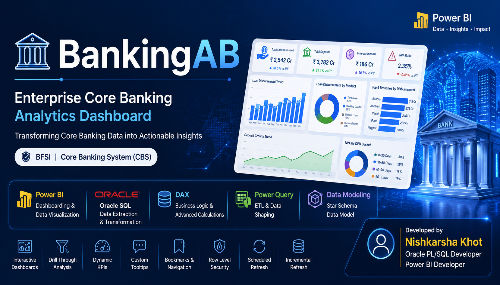
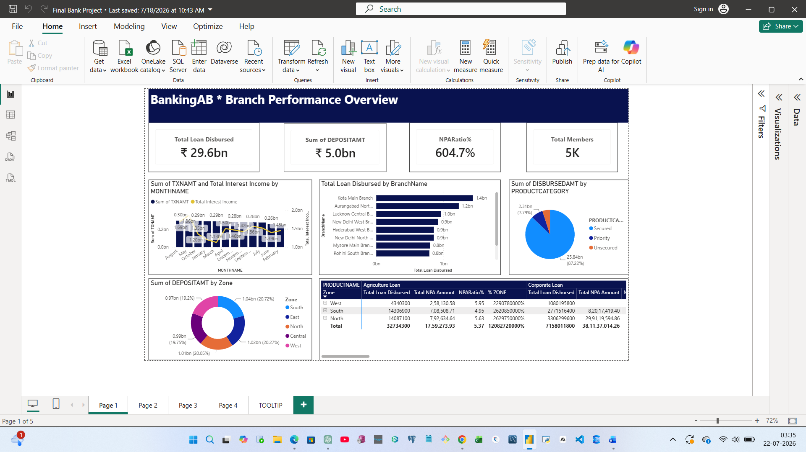
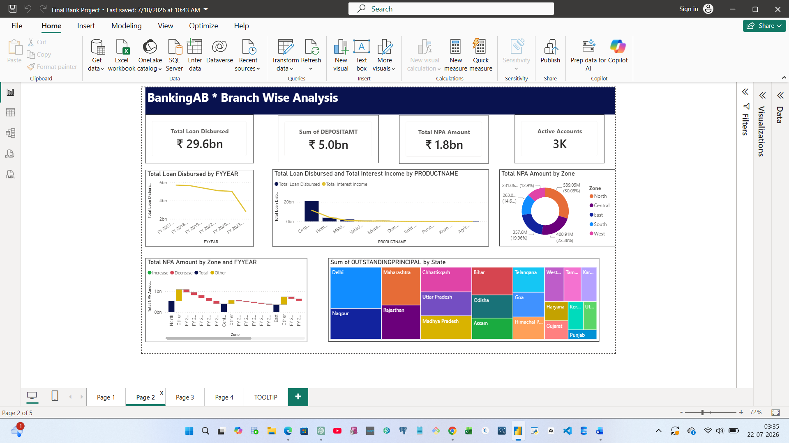
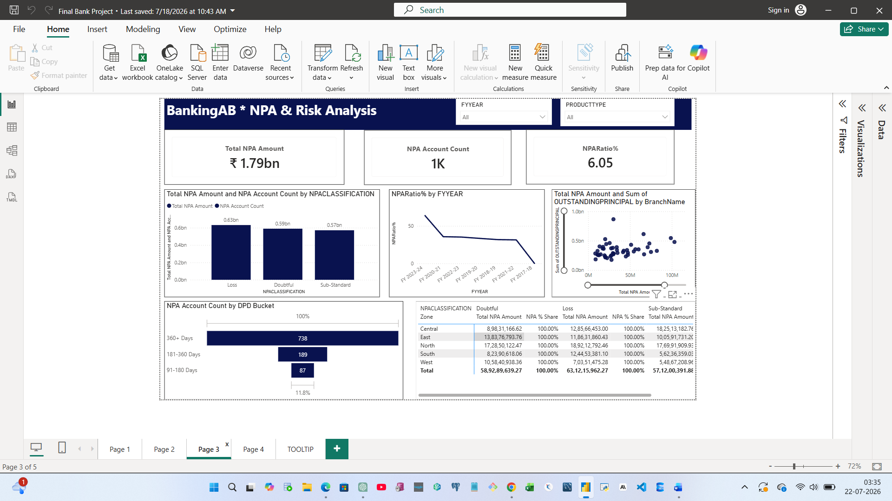
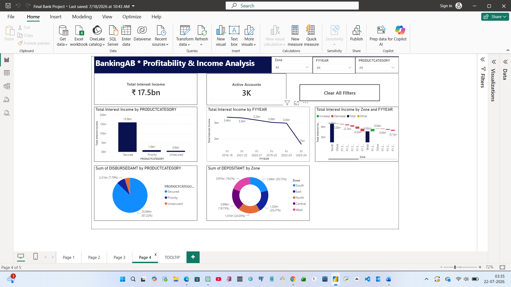
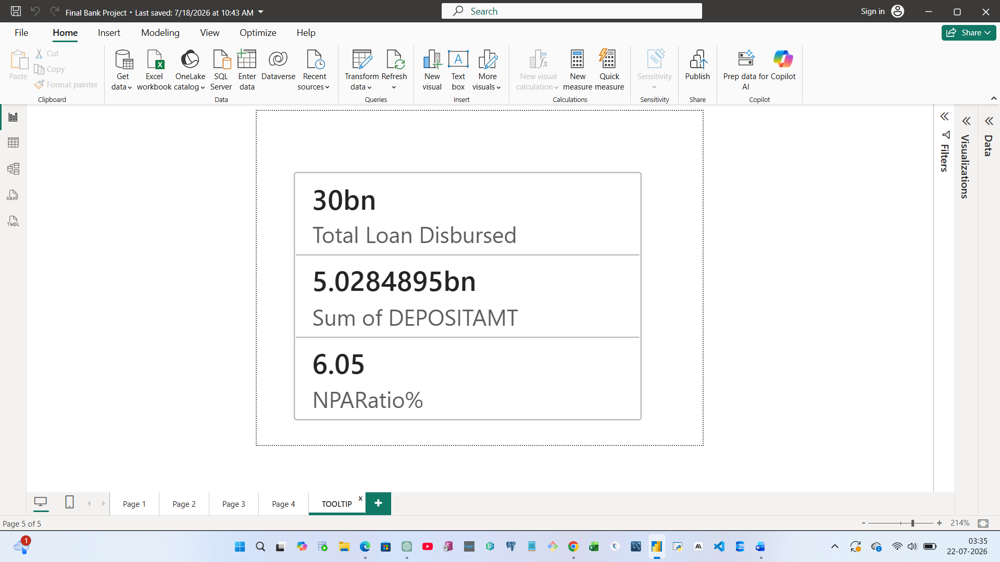
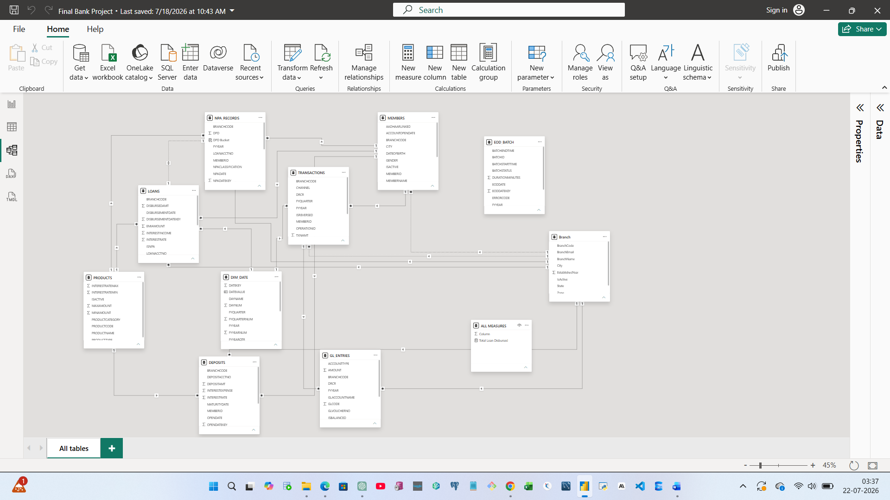

<p align="center">
  
</p>

<p align="center">


</p>

## 📌 Project Summary

| Category | Details |
|----------|---------|
| Domain | Banking (BFSI) |
| Tool | Microsoft Power BI |
| Database | Oracle Database |
| ETL | Power Query |
| Language | DAX, SQL |
| Data Model | Star Schema |
| Reports | 5 Interactive Dashboards |
| KPIs | 30+ |
| Drill Through | ✅ |
| Tooltips | ✅ |
| Bookmarks | ✅ |
| Row Level Security | ✅ |

# 🏦 BankingAB – Enterprise Core Banking Analytics Dashboard

> **An end-to-end Power BI solution for Core Banking System (CBS) analytics built using Oracle SQL, Power Query, DAX, and Power BI Service.**

---

## 📌 Project Overview

BankingAB is an enterprise-style Power BI portfolio project designed to demonstrate real-world Business Intelligence development in the Banking (BFSI) domain.

The project transforms raw Core Banking System (CBS) data into interactive dashboards that help bank managers, auditors, and executives monitor business performance.

---

## 🎯 Business Objectives

- Monitor Loan Disbursement
- Analyze Deposit Growth
- Track Interest Income
- Identify Non-Performing Assets (NPA)
- Compare Branch Performance
- Analyze Banking Transactions
- Support Management Decision Making

---

## 🛠 Technology Stack

| Technology | Purpose |
|------------|---------|
| Power BI Desktop | Dashboard Development |
| Oracle SQL | Data Source |
| Power Query | ETL & Data Cleaning |
| DAX | Business Calculations |
| Power BI Service | Publishing & Refresh |
| Data Gateway | Oracle Connectivity |

---

## 📊 Dashboard Pages

### 1️⃣ Branch Performance Overview

- KPI Cards
- Loan Disbursement
- Deposit Analysis
- Interest Income
- Top Performing Branches
- Product Performance

---

### 2️⃣ Branch Wise Analysis

- Branch Trends
- Waterfall Analysis
- State Comparison
- Product Analysis

---

### 3️⃣ NPA & Risk Analysis

- NPA Ratio
- DPD Analysis
- Risk Classification
- Branch Risk Comparison

---

### 4️⃣ Profitability & Income Analysis

- Interest Income
- Profit Trend
- Zone Comparison
- Product Contribution

---

## 📊 Dashboard Preview

### Branch Performance Dashboard



---

### Branch Analysis Dashboard



---

### NPA Analysis Dashboard



---

### Profitability Dashboard



---

### Custom Tooltip



## ⭐ Data Model

The project follows a **Star Schema** for optimal performance and scalability.



## ⭐ Key Features

- Star Schema Data Model
- Power Query ETL
- Dynamic DAX Measures
- Drill Through
- Bookmarks
- Custom Tooltips
- Row-Level Security (RLS)
- Scheduled Refresh
- Incremental Refresh

---

## 📂 Repository Structure

```text
BankingAB-PowerBI-Portfolio
│
├── PBIX
├── Documentation
├── Images
├── DAX
├── SQL
├── Insights
├── Dataset
```

---

## 📈 Skills Demonstrated

- Power BI
- Oracle SQL
- DAX
- Power Query
- Data Modeling
- ETL
- Dashboard Design
- Banking Analytics
- Business Intelligence

---

## 👨‍💻 Author

**Nishkarsha Khot**

Oracle PL/SQL Developer | Power BI Developer

Nagpur, Maharashtra, India
